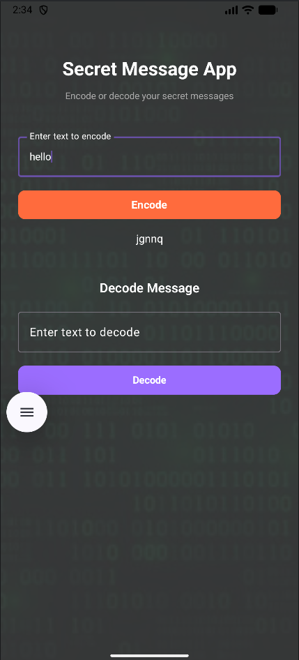

# 🔐 Secret Message App

🚀 A sleek Android app built using **Jetpack Compose** that allows users to encode and decode secret messages using a simple yet effective transformation technique.

---

## ✨ Features

* 🔒 Encode plain text into a secret message
* 🔓 Decode messages back to original text
* 🎨 Modern dark-themed UI with vibrant buttons
* ⚡ Fast, lightweight, and easy to use
* 📱 Built fully using Jetpack Compose

---

## 🛠️ Tech Stack

* **Kotlin**
* **Jetpack Compose**
* **Android Studio**

---

## 📸 Screenshots

| 🔐 Encoding a Message             | 🔓 Decoding a Message             |
| --------------------------------- | --------------------------------- |
|  |  |

---

## ⚙️ How It Works

The app uses a simple character-shifting algorithm:

* 🔼 **Encoding:** Each character is shifted by **+2**
* 🔽 **Decoding:** Each character is shifted by **-2**

### Example:

```
hello → jgnnq  
jgnnq → hello
```

---

## ▶️ How to Run the App

1. **Clone the repository**

```
git clone https://github.com/Savree97/Secret_Message_App.git
```

2. **Open in Android Studio**

* Launch Android Studio
* Click *Open*
* Select the project folder

3. **Sync the project**

* Let Gradle sync automatically
* Install required SDK components if prompted

4. **Run the app**

* Select an emulator or connect a physical device
* Click ▶️ Run

5. **Done! 🎉**

* The app will launch on your device/emulator

---

## 📌 Requirements

* Android Studio (latest version recommended)
* Android SDK installed
* Emulator or physical Android device

---

## 📂 Project Structure

* `MainActivity.kt` → Entry point
* `screen.kt` → UI + encode/decode logic
* `res/` → UI resources and assets

---

## 🎯 Future Improvements

* 📋 Copy to clipboard feature
* 🎨 Animations and transitions
* 🔐 Advanced encryption methods
* 🌐 Share encoded messages

---

## 👩‍💻 Author

**Savree Dohar**  
Passionate about building intuitive and impactful applications 🚀

---

❤️ Made with love and a passion for building meaningful tech.
